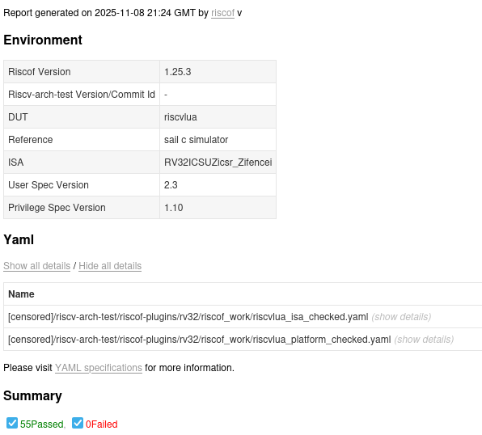

## RISC-V Simulator in Lua
This simulator passes all `I, privilege` tests from [riscv-arch-test](https://github.com/riscv-non-isa/riscv-arch-test) on branch `main`.
You can check this by following the standard testing procedure with riscof by using the riscof plugin
[riscof_riscvlua](./riscof_riscvlua) provided in this repository, as long as you have the driver script `riscvlua` in your path.

